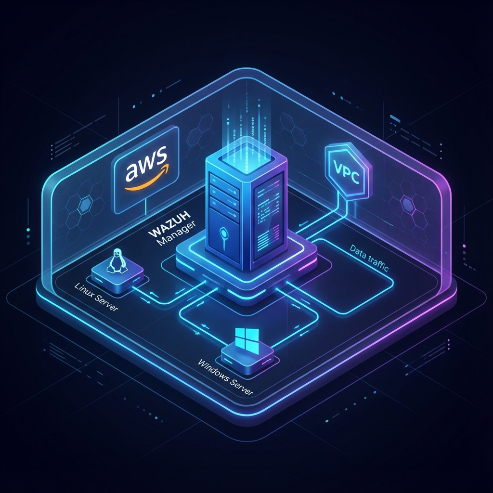
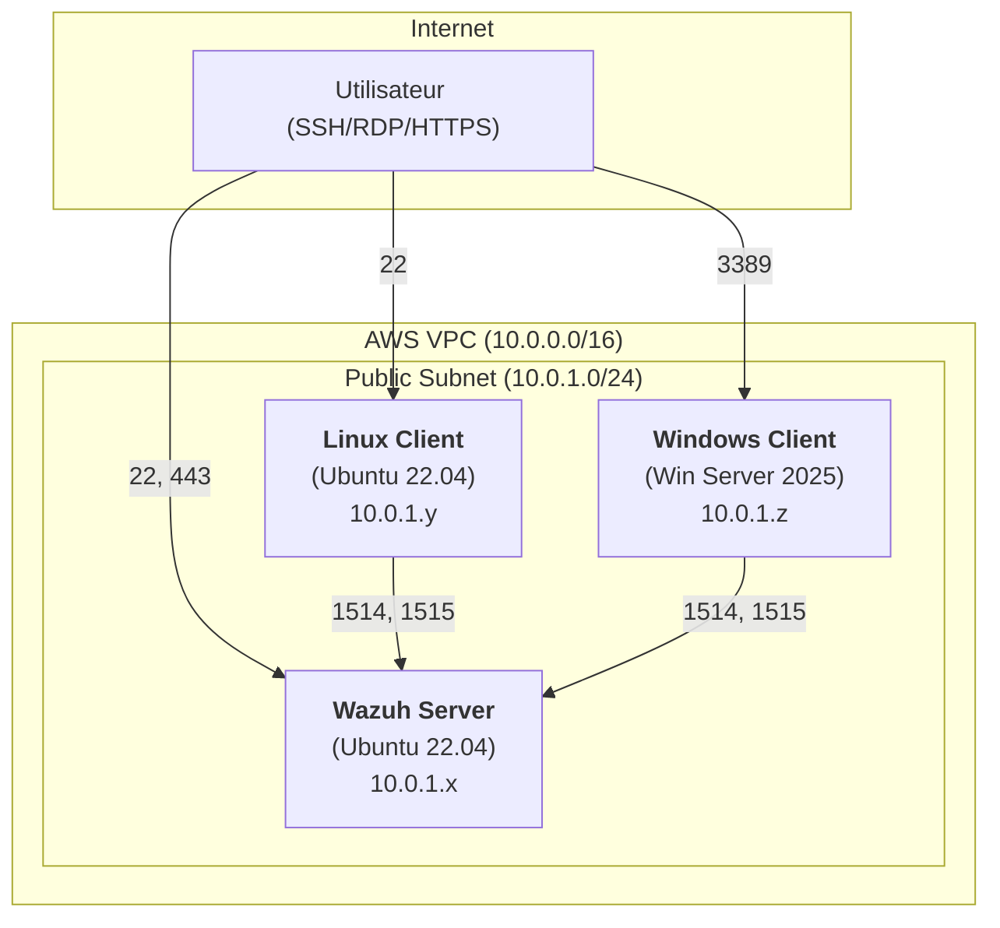

# Atelier Sécurité des Endpoints et Supervision SIEM

Ce projet contient l'infrastructure en tant que code (IaC) pour déployer un laboratoire de supervision de sécurité basé sur **Wazuh** sur AWS.

## Architecture du Lab

Le laboratoire est déployé dans un VPC dédié avec une architecture centrée sur la visibilité et la sécurité des endpoints.

### Schéma Conceptuel

### Détails des Composants

#### 1. Instances EC2
Toutes les instances utilisent le type `m7i-flex.large` pour des performances optimales durant l'analyse.

| Instance | OS | Stockage | Rôle |
| :--- | :--- | :--- | :--- |
| **Wazuh-Server** | Ubuntu 22.04 | 150 GB (gp3) | Manager Wazuh, Indexeur, Tableau de bord |
| **Linux-Client** | Ubuntu 22.04 | 50 GB (gp3) | Agent de supervision Linux |
| **Windows-Client** | Windows Server 2025 | 50 GB (gp3) | Agent de supervision Windows |

#### 2. Sécurité Réseau (Security Groups)

**Wazuh Server Security Group (`wazuh-server-sg`) :**
- **Inbound :**
    - `22/TCP` : Accès SSH (Administration)
    - `443/TCP` : Interface Web Wazuh Dashboard
    - `1514/TCP` : Communication Agent (depuis le SG Client)
    - `1515/TCP` : Enrôlement Agent (depuis le SG Client)
- **Outbound :** Tout autorisé (`0.0.0.0/0`)

**Wazuh Client Security Group (`wazuh-client-sg`) :**
- **Inbound :**
    - `22/TCP` : Accès SSH pour le client Linux
    - `3389/TCP` : Accès RDP pour le client Windows
- **Outbound :** Tout autorisé (`0.0.0.0/0`)

## Guide d'Utilisation

L'infrastructure est située dans le répertoire `iac/`.

### Déploiement
1. `cd iac`
2. `terraform init`
3. `terraform apply`

### Accès
- La clé privée SSH est générée et stockée sous `iac/wazuh-lab-key.pem`.
- Les adresses IP publiques sont affichées en sortie de la commande `terraform apply`.

---
*Projet réalisé dans le cadre de l'atelier Sécurité des endpoints et supervision SIEM.*